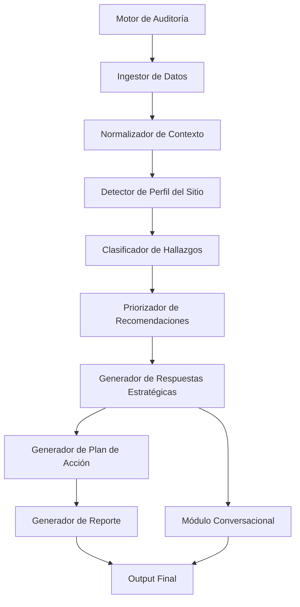

# FASE 7 – Diseño del Motor de IA de SiteVision Pro

## 1. Objetivo del Motor de IA

El Motor de IA es el principal diferenciador de SiteVision Pro. Su propósito no es solo resumir datos técnicos, sino actuar como un consultor digital experto que interpreta los resultados de la auditoría y genera recomendaciones personalizadas, priorizadas y accionables.

Debe combinar conocimiento de:
- desarrollo web
- arquitectura de software
- UX/UI
- SEO técnico
- marketing digital
- CRO
- accesibilidad
- seguridad web
- performance
- copywriting
- analítica digital

La IA debe traducir información técnica en valor de negocio, facilitando decisiones concretas para equipos de producto, marketing, desarrollo y negocio.

---

## 2. Principios de diseño

1. Interpretación, no solo síntesis
   - No debe limitarse a repetir hallazgos.
   - Debe explicar por qué importan y qué hacer con ellos.

2. Personalización por contexto
   - El motor debe adaptar sus consejos al tipo de negocio, industria y objetivos del sitio.

3. Priorización inteligente
   - No todas las recomendaciones tienen el mismo impacto.
   - Debe ordenar por beneficio, esfuerzo y riesgo.

4. Trazabilidad
   - Cada recomendación debe poder vincularse a evidencia técnica concreta.

5. Extensibilidad
   - Debe poder incorporar nuevos modelos, reglas y fuentes de conocimiento sin romper la arquitectura.

6. Transparencia
   - La IA debe explicar por qué una acción fue recomendada.

---

## 3. Arquitectura general del Motor de IA

### 3.1 Componentes principales

- Ingestor de Datos
- Normalizador de Contexto
- Detector de Perfil del Sitio
- Clasificador de Hallazgos
- Priorizador de Recomendaciones
- Generador de Respuestas Estratégicas
- Generador de Plan de Acción
- Generador de Reporte
- Módulo Conversacional
- Módulo de Evaluación y Feedback
- Adaptador de Modelos IA

### 3.2 Responsabilidades por componente

#### Ingestor de Datos
Recibe los resultados del Motor de Auditoría y los transforma en un objeto de contexto entendible para la IA.

#### Normalizador de Contexto
Estandariza métricas, hallazgos, severidades y evidencias para que la IA opere sobre un formato uniforme.

#### Detector de Perfil del Sitio
Identifica automáticamente la industria, tipo de negocio, objetivo principal, público objetivo, tecnologías detectadas y nivel de madurez digital.

#### Clasificador de Hallazgos
Agrupa los hallazgos por categoría, impacto, negocio y urgencia.

#### Priorizador de Recomendaciones
Ordena las acciones según impacto esperado, esfuerzo, riesgo y valor estratégico.

#### Generador de Respuestas Estratégicas
Produce recomendaciones contextuales, con explicaciones de negocio y criterios técnicos.

#### Generador de Plan de Acción
Convierte las recomendaciones en una ruta priorizada con pasos concretos.

#### Generador de Reporte
Compone el informe final en secciones ejecutivas, técnicas y accionables.

#### Módulo Conversacional
Permite interactuar con el usuario sobre los resultados del análisis.

#### Módulo de Evaluación y Feedback
Recoge retroalimentación para mejorar futuras respuestas y ajustar heurísticas.

#### Adaptador de Modelos IA
Aísla al sistema de un modelo concreto para facilitar cambios entre OpenAI, modelos propios o proveedores alternativos.

---

## 4. Arquitectura de alto nivel



---

## 5. Flujo completo del Motor de IA

### 5.1 Flujo principal

1. El Motor de Auditoría entrega un resultado consolidado.
2. El Ingestor de Datos recibe el payload de auditoría.
3. El Normalizador convierte hallazgos, métricas y evidencias a un formato estándar.
4. El Detector de Perfil del Sitio identifica el contexto del negocio.
5. El Clasificador organiza los hallazgos por categoría y urgencia.
6. El Priorizador determina qué acciones deben abordarse primero.
7. El Generador de Respuestas Estratégicas produce recomendaciones con explicación y contexto.
8. El Generador de Plan de Acción organiza estas recomendaciones en una hoja de ruta priorizada.
9. El Generador de Reporte compone el informe final.
10. El módulo conversacional permite preguntas posteriores sobre los resultados.

### 5.2 Flujo de decisión de recomendaciones

Cada hallazgo pasa por:
- interpretación de impacto
- asociación con un objetivo de negocio
- evaluación de esfuerzo
- cálculo de beneficio esperado
- asignación de prioridad

---

## 6. Perfil del Sitio

El Motor de IA debe inferir automáticamente el contexto del sitio para adaptar el análisis.

## 6.1 Información que debe identificar

- Industria
- Tipo de negocio
- Público objetivo
- Objetivo principal del sitio
- Tecnologías utilizadas
- Nivel de madurez digital
- Tipo de conversión principal
- Público geográfico

## 6.2 Categorías posibles

- Ecommerce
- Clínica
- Universidad
- SaaS
- Restaurante
- Agencia
- Inmobiliaria
- Blog
- Landing Page
- Marketplace

## 6.3 Método de inferencia

El perfil del sitio puede inferirse por:
- contenido textual del sitio
- estructura de navegación
- presencia de formularios o ecommerce
- tecnologías detectadas
- enlaces y rutas importantes
- señales de marketing y conversión

## 6.4 Salida del perfil

```json
{
  "industry": "ecommerce",
  "businessType": "online retail",
  "audience": "consumers",
  "primaryGoal": "increase conversions",
  "techStack": ["nextjs", "shopify", "google analytics"],
  "digitalMaturity": "medium"
}
```

---

## 7. Sistema de recomendaciones

## 7.1 Objetivo

Cada recomendación debe clasificarse y priorizarse para que el usuario pueda actuar con claridad.

## 7.2 Atributos de una recomendación

Cada recomendación debe incluir:
- prioridad
- impacto esperado
- dificultad de implementación
- tiempo estimado
- categoría
- beneficio esperado
- motivación de negocio
- evidencia técnica asociada
- pasos de ejecución

## 7.3 Modelo de prioridad

### Niveles de prioridad
- P0: crítica
- P1: alta
- P2: media
- P3: baja

### Criterios de clasificación
- impacto en conversion
- impacto en experiencia de usuario
- riesgo de negocio o seguridad
- esfuerzo de implementación
- relación con objetivos del sitio

## 7.4 Escala de impacto

- Bajo
- Medio
- Alto
- Crítico

## 7.5 Escala de dificultad

- Baja
- Media
- Alta
- Muy alta

## 7.6 Escala de tiempo estimado

- 1–3 días
- 1–2 semanas
- 2–4 semanas
- 1+ meses

## 7.7 Ejemplo de recomendación

```json
{
  "id": "rec_001",
  "title": "Optimizar el tiempo de carga del hero principal",
  "priority": "P1",
  "impact": "high",
  "difficulty": "medium",
  "estimatedTime": "1-2 weeks",
  "category": "performance",
  "benefit": "improve bounce rate and conversion",
  "reason": "LCP and image delivery are affecting perceived speed",
  "evidence": ["lcp: 3.2s", "large images detected"],
  "actions": [
    "compress images",
    "defer non-critical JS",
    "use modern formats"
  ]
}
```

---

## 8. Plan de acción inteligente

## 8.1 Objetivo

La IA debe transformar hallazgos en una hoja de ruta priorizada y accionable.

## 8.2 Estructura del plan de acción

Cada acción debe incluir:
- explicación del problema
- motivo de negocio
- beneficio esperado
- esfuerzo estimado
- prioridad
- pasos concretos
- ejemplos de código cuando corresponda

## 8.3 Formato recomendado

```json
{
  "phase": "short term",
  "actions": [
    {
      "title": "Optimizar imágenes del hero",
      "explanation": "El hero actual utiliza imágenes de gran tamaño que afectan la carga inicial.",
      "reason": "Reduce LCP y mejora la primera impresión.",
      "benefit": "Mejor rendimiento percibido y menor abandono.",
      "priority": "high",
      "estimatedTime": "3 days",
      "exampleCode": ""
    }
  ]
}
```

## 8.4 Ejemplo de ruta priorizada

1. Optimizar imágenes y recursos críticos.
2. Corregir títulos y descripciones SEO.
3. Agregar Schema.org relevante.
4. Mejorar el CTA principal.
5. Reducir JavaScript bloqueante.
6. Corregir problemas de accesibilidad básicos.
7. Fortalecer seguridad de headers y cookies.

---

## 9. Generación del reporte

## 9.1 Objetivo

El informe debe ser profesional, claro y útil tanto para desarrolladores como para clientes sin conocimientos técnicos.

## 9.2 Secciones recomendadas

### Resumen ejecutivo
- síntesis del estado general del sitio
- principales problemas detectados
- valor de negocio de las mejoras

### Hallazgos principales
- listado claro de issues con impacto y contexto

### Problemas críticos
- riesgos de conversión, seguridad o rendimiento

### Aspectos positivos
- puntos fuertes del sitio
- lo que ya está bien

### Riesgos
- riesgos comerciales, técnicos o de reputación

### Recomendaciones
- acciones claras y priorizadas
- explicación de por qué importa

### Conclusiones
- resumen final con próximos pasos

## 9.3 Estilo de redacción

Debe mezclarse:
- rigor técnico
- lenguaje claro para negocio
- tono ejecutivo y accionable

---

## 10. Conversación inteligente

## 10.1 Objetivo

Permitir una experiencia conversacional posterior a la auditoría.

## 10.2 Casos de uso recomendados

### Usuario pregunta: “¿Por qué obtuve solo 62 puntos?”
La IA debe responder con:
- los factores reales que impactaron la puntuación
- la relación con hallazgos concretos
- explicación comprensible del resultado

### Usuario pregunta: “¿Cómo soluciono este problema?”
La IA debe entregar:
- pasos concretos
- mejores prácticas
- ejemplos de código cuando sea útil
- recomendaciones por prioridad

### Usuario pregunta: “¿Qué debería hacer primero?”
La IA debe responder con:
- una orden de acción priorizada
- impacto esperado
- esfuerzo estimado

## 10.3 Requisitos del módulo conversacional

- contexto de la auditoría
- acceso a hallazgos y puntuaciones
- capacidad de referirse a evidencia real
- respuesta precisa, breve y accionable

---

## 11. Integración con modelos de IA

## 11.1 Arquitectura de integración

El motor debe usar un adaptador de modelos para aislar la lógica del sistema del proveedor concreto.

### Proveedores soportados
- OpenAI
- modelos propios
- proveedores alternativos en el futuro

## 11.2 Estrategia recomendada

- usar IA para razonamiento estratégico y redacción
- usar reglas determinísticas para métricas y puntuaciones
- evitar delegar por completo la lógica de negocio a la IA

## 11.3 Ventaja de esta combinación

- la IA mejora la interpretación del contexto
- las reglas garantizan consistencia y trazabilidad
- la arquitectura permite sustituir el modelo sin reescribir el sistema

---

## 12. Aprendizaje y evolución

## 12.1 Objetivo

El sistema debe poder incorporar nuevos modelos, nuevos motores de análisis y nuevas reglas sin modificar la arquitectura principal.

## 12.2 Estrategia de evolución

- usar interfaces claras para modelos y módulos
- separar reglas de negocio de la capa de generación de texto
- almacenar configuraciones en un catálogo modular
- capacitar el sistema con feedback humano
- permitir nuevas estrategias de recomendación sin tocar el núcleo

## 12.3 Recomendación de diseño

Implementar una arquitectura basada en:
- adaptadores de modelos
- estrategias de priorización
- módulos de recomendación
- pipeline de generación

---

## 13. Formato de entrada y salida

## 13.1 Entrada al Motor de IA

El motor recibe un payload JSON consolidado desde el Motor de Auditoría, incluyendo:
- scores por categoría
- hallazgos técnicos
- métricas crudas
- perfil del sitio
- contexto del negocio
- evidencias

## 13.2 Salida esperada

El motor debe devolver:
- resumen ejecutivo
- hallazgos interpretados
- recomendaciones priorizadas
- plan de acción
- riesgos y observaciones
- respuesta conversacional (si aplica)

## 13.3 Ejemplo de salida

```json
{
  "summary": "El sitio presenta problemas importantes de rendimiento y conversión en la etapa inicial de carga.",
  "topFindings": [
    "LCP alto",
    "CTA poco visible",
    "Falta de schema relevante"
  ],
  "recommendations": [
    {
      "title": "Optimizar imágenes críticas",
      "priority": "high"
    }
  ],
  "actionPlan": [
    {
      "title": "Optimizar carga inicial",
      "priority": "high"
    }
  ]
}
```

---

## 14. Riesgos técnicos

### Riesgos principales
- respuestas demasiado genéricas o poco accionables
- interpretación inconsistente entre auditorías
- dependencia excesiva de una sola IA
- sesgos en recomendaciones
- coste elevado de uso de modelos grandes

### Mitigaciones
- combinar IA con reglas determinísticas
- usar evidencia real y trazable
- aplicar límites y guardrails
- establecer políticas de calidad en las respuestas
- hacer evaluaciones humanas sobre respuestas críticas

---

## 15. Recomendaciones para la implementación

### Fase inicial
1. Definir el payload estandarizado de entrada.
2. Implementar el pipeline de normalización y clasificación.
3. Crear el módulo de perfil del sitio.
4. Implementar el sistema de recomendaciones con prioridad y impacto.
5. Generar un resumen ejecutivo y un plan de acción básico.
6. Integrar la capa de conversación posterior.

### Fase posterior
1. Incorporar modelos más avanzados.
2. Añadir aprendizaje por feedback.
3. Integrar más fuentes de contexto y analítica.
4. Mejorar la personalización por industria.

---

## 16. Recomendación final

El Motor de IA de SiteVision Pro debe ser un sistema híbrido, que combine reglas determinísticas con razonamiento generativo para producir recomendaciones inteligentes, priorizadas y accionables. Su valor no estará solo en analizar datos, sino en convertir resultados técnicos en decisiones útiles para negocio, producto, marketing y desarrollo.
