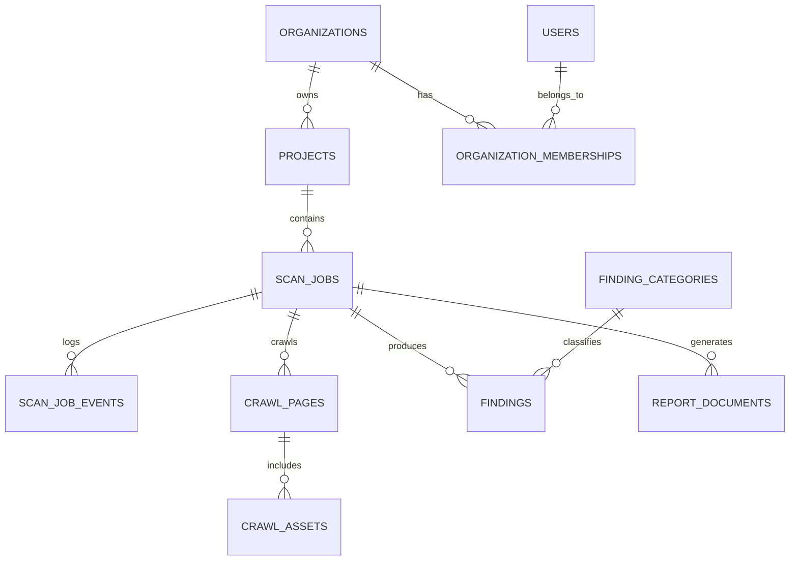

# Fase 1 — Arquitectura de SiteVision Pro

## 1. Visión general del sistema

SiteVision Pro es una plataforma SaaS orientada a analizar sitios web, capturar evidencia técnica y generar reportes accionables para usuarios empresariales. El producto debe permitir que un usuario ingrese una URL, dispare un proceso de inspección, y reciba un informe con hallazgos sobre rendimiento, SEO, accesibilidad, seguridad, estructura técnica y calidad general del sitio.

La arquitectura propuesta prioriza:
- Escalabilidad para múltiples ejecuciones concurrentes.
- Seguridad y cumplimiento desde el diseño.
- Separación clara de responsabilidades entre frontend, API, workers y almacenamiento.
- Capacidad de evolucionar hacia análisis más avanzados, incluyendo IA, alertas y auditorías programadas.

> Esta propuesta corresponde a la Fase 1 de arquitectura y no implementa funcionalidad de negocio todavía.

---

## 2. Arquitectura de alto nivel

El sistema se organiza como una plataforma distribuida modular, compuesta por:

1. Frontend de usuario
2. API Gateway / Backend de aplicación
3. Servicios de orquestación y procesamiento
4. Workers asincrónicos para crawling, análisis y generación de reportes
5. Almacenamiento persistente y caché
6. Observabilidad, seguridad y despliegue automatizado

### Componentes principales
- Cliente web: interfaz para registrar URL, monitorear estado del análisis y ver reportes.
- API principal: expone operaciones para crear jobs, consultar estados y obtener resultados.
- Servicio de ingesta: recibe URLs, valida entrada, prepara el job y despacha tareas.
- Servicio de crawling: obtiene contenido del sitio y captura evidencia.
- Servicio de análisis: aplica reglas técnicas, métricas y heurísticas.
- Servicio de reportes: compone el informe final en formato ejecutivo y técnico.
- Cola de eventos: desacopla la ejecución y mejora la tolerancia a fallos.
- Base de datos: almacena jobs, resultados, usuarios, configuración y auditoría.
- Object storage: guarda snapshots, capturas, PDFs, HTML y artefactos de análisis.

---

## 3. Arquitectura Frontend

### Objetivo
Proveer una experiencia simple, rápida y profesional para:
- Ingresar una URL.
- Ver el estado del análisis.
- Consultar reportes históricos.
- Explorar hallazgos por categoría.

### Propuesta tecnológica
- Next.js con TypeScript
- React Server Components cuando sea útil
- Tailwind CSS para diseño consistente
- React Query o TanStack Query para manejo de estado de servidor
- Zustand o Context API para estado local de UI
- Componentes reutilizables y diseño basado en Atomic Design

### Principios de diseño frontend
- Arquitectura orientada a componentes y dominio.
- Separación entre capa de presentación y lógica de negocio.
- Diseño responsive y accesible.
- Manejo de estados de carga, error y reintento.
- Preparado para incorporar dashboards y analítica avanzada.

### Estructura conceptual del frontend
- app/ (rutas, layouts, páginas)
- features/ (módulos de negocio)
- components/ (componentes reutilizables)
- hooks/ (lógica reutilizable)
- services/ (consumo de APIs)
- types/ (modelos compartidos)

---

## 4. Arquitectura Backend

### Objetivo
Centralizar la lógica de negocio y coordinar los procesos de inspección del sitio.

### Propuesta tecnológica
- NestJS con TypeScript como API principal
- Arquitectura hexagonal / Clean Architecture
- Controladores para entrada HTTP
- Servicios de aplicación para casos de uso
- Repositorios para persistencia
- Eventos para comunicación entre módulos

### Servicios backend propuestos
- Auth Service: autenticación, autorización, roles y sesión.
- Job Orchestrator: crea y gestiona jobs de análisis.
- Crawl Service: coordina la ingesta de contenido y recursos del sitio.
- Analysis Service: ejecuta reglas y métricas de evaluación.
- Report Service: genera el resultado consolidado.
- Notification Service: notifica eventos al usuario o a sistemas externos.

### Beneficios
- Bajo acoplamiento entre módulos.
- Facilidad para testear cada capa por separado.
- Mejor trazabilidad para auditoría y soporte.

---

## 5. Comunicación entre servicios

La comunicación debe ser híbrida:

### Comunicación síncrona
- REST para operaciones de negocio directas.
- JSON como formato de intercambio.
- Autenticación por token JWT o sesiones federadas mediante OIDC.

### Comunicación asíncrona
- Cola de mensajes como Redis Streams, RabbitMQ o Kafka.
- Ideal para tareas largas como crawling, procesamiento y generación de reportes.
- Permite escalar workers de forma independiente.

### Integración de eventos
- JobCreated
- CrawlStarted
- CrawlCompleted
- AnalysisCompleted
- ReportReady
- ReportFailed

Esta estrategia evita que una tarea lenta bloquee la experiencia del usuario y permite mayor resiliencia.

---

## 6. Flujo completo desde que el usuario ingresa una URL hasta que recibe el reporte

### Flujo principal
1. El usuario ingresa una URL en el frontend.
2. El frontend valida el formato y envía la solicitud al backend.
3. El backend valida la URL, crea un job de análisis y registra el registro en base de datos.
4. El sistema encola una tarea de procesamiento asíncrono.
5. El worker de crawling visita la URL y captura contenido, assets, estructura DOM y metadatos relevantes.
6. El worker de análisis procesa los datos y aplica reglas para rendimiento, seguridad, SEO, accesibilidad y calidad general.
7. El servicio de reportes construye un resultado consolidado.
8. El resultado se almacena y se notifica al usuario.
9. El usuario puede ver el estado del job y abrir el reporte final.

### Flujo alternativo de error
- URL inválida o no accesible.
- Timeout de crawling.
- Bloqueo por anti-bot o políticas de seguridad.
- Fallo de un worker.

En todos estos casos el sistema debe registrar el error, generar un estado de fallo y exponer una recomendación clara al usuario.

---

## 7. Organización del monorepo

Se recomienda un monorepo para maximizar coherencia entre frontend, backend y servicios compartidos.

### Estructura propuesta

```text
repo/
  apps/
    web/
    api/
    workers/
  packages/
    ui/
    config/
    shared-types/
    eslint-config/
    tsconfig/
  services/
    crawler/
    analyzer/
    reporter/
  infra/
    docker/
    kubernetes/
    terraform/
  docs/
    architecture/
    runbooks/
  scripts/
```

### Justificación
- Facilita compartir modelos, utilidades y estándares.
- Reduce duplicación entre módulos.
- Permite versionar arquitectura y componentes de forma consistente.
- Simplifica la adopción de CI/CD y políticas de calidad.

---

## 8. Estructura de carpetas

### Aplicación web
```text
apps/web/
  app/
  components/
  features/
  hooks/
  lib/
  public/
  styles/
```

### API principal
```text
apps/api/
  src/
    modules/
    common/
    infrastructure/
    domain/
    application/
```

### Workers
```text
apps/workers/
  src/
    jobs/
    tasks/
    providers/
    workers/
```

### Paquetes compartidos
```text
packages/shared-types/
packages/ui/
packages/config/
```

---

## 9. Patrones de diseño

### Patrones recomendados
- Clean Architecture / Hexagonal Architecture
  - Separación entre dominio, casos de uso e infraestructura.
- Repository Pattern
  - Abstracción de persistencia.
- Strategy Pattern
  - Diferentes estrategias de análisis según tipo de sitio o regla.
- Factory Pattern
  - Creación de workers y pipelines según el tipo de tarea.
- Observer / Event-driven Pattern
  - Procesos desacoplados por eventos.
- Circuit Breaker y Retry Policy
  - Para tolerar fallos temporales y evitar cascadas.

### Beneficios
- Código más testeable.
- Menor acoplamiento.
- Facilita evolución del sistema sin reescribir módulos completos.

---

## 10. Tecnologías elegidas y justificación

### Frontend
- Next.js: productividad, SSR/SSG, ecosistema maduro.
- TypeScript: seguridad de tipos y escalabilidad.
- Tailwind CSS: velocidad de desarrollo y consistencia visual.

### Backend
- NestJS: estructura empresarial sólida para APIs y módulos.
- TypeScript: coherencia con el frontend y mejor mantenibilidad.

### Procesamiento y crawling
- Node.js + Playwright o Puppeteer: navegación real de sitios y captura de evidencia.
- Para análisis más pesado, se puede complementar con un servicio especializado en Python si se requiere IA o procesamiento intensivo.

### Persistencia
- PostgreSQL: datos relacionales, auditoría y trazabilidad.
- Redis: caché, colas y coordinación de workers.
- Object Storage: snapshots, reportes y artefactos.

### Observabilidad
- OpenTelemetry
- Prometheus + Grafana
- Loki / ELK para logs

### DevOps
- Docker
- Kubernetes o ECS
- Terraform
- GitHub Actions o GitLab CI

---

## 11. Estrategia de escalabilidad

### Escalabilidad horizontal
- Los workers pueden escalarse de forma independiente según la carga.
- La API puede escalarse con múltiples instancias detrás de un balanceador.

### Escalabilidad vertical y por capacidad
- Separación de lectura/escritura si el volumen crece sustancialmente.
- Uso de caché para resultados frecuentes y consultas recurrentes.
- Particionamiento lógico por tenant, proyecto o fecha si la plataforma crece.

### Optimización del pipeline
- Priorizar tareas por urgencia y tipo.
- Limitar concurrencia por dominio para evitar sobrecarga de sitios externos.
- Introducir reintentos controlados y backoff exponencial.

---

## 12. Estrategia de seguridad

### Medidas base
- Autenticación y autorización robusta.
- RBAC por rol y permisos por proyecto.
- TLS en tránsito y cifrado en reposo.
- Gestión centralizada de secretos.
- Rate limiting y protección contra abuso.
- Validación estricta de entradas y sanitización de salidas.

### Seguridad de la ejecución de crawlers
- Aislamiento de workers.
- Limitación de recursos por tarea.
- Manejo seguro de cookies, tokens y credenciales si el sistema los necesita.
- Revisión de políticas de scraping responsable.

### Seguridad de software
- SAST/DAST en CI/CD.
- Dependabot o herramientas equivalentes.
- Auditoría de dependencias y escaneo de vulnerabilidades.
- Logs de auditoría y trazabilidad de cambios.

---

## 13. Estrategia de despliegue

### Entorno recomendado
- Contenedores Docker para cada componente.
- Kubernetes como capa de orquestación para producción.
- Terraform para infraestructura como código.
- Pipeline CI/CD con validación, tests, escaneos y despliegue progresivo.

### Modelo de despliegue
- Entornos: desarrollo, staging y producción.
- Despliegue blue/green o canary para reducir riesgo.
- Health checks y auto-restart para workers y API.

### Operación
- Monitoreo continuo.
- Alertas por errores, latencia y fallos de workers.
- Backups automáticos de base de datos y artefactos.

---

## 14. Riesgos técnicos

### Riesgos principales
- Sitios que bloquean crawlers o cambian su estructura con frecuencia.
- Coste operacional de ejecuciones concurrentes muy altas.
- Dependencia de recursos externos y latencia de red.
- Complejidad creciente si los análisis se vuelven más sofisticados.
- Riesgos de seguridad derivados de la ejecución de contenido remoto.

### Mitigaciones
- Diseño modular y desacoplado.
- Reglas de timeout y límites por dominio.
- Cobertura de pruebas por componente.
- Estrategia de observabilidad desde el inicio.
- Aislamiento de ejecución y políticas de seguridad explícitas.

---

## 15. Roadmap técnico inicial

### Fase 1 — Arquitectura y base del producto
- Definir arquitectura de alto nivel.
- Establecer monorepo y estructura base.
- Crear contrato de API inicial.
- Definir modelos de datos clave.
- Preparar infraestructura base y CI/CD.

### Fase 2 — MVP funcional
- Implementar ingreso de URL y creación de jobs.
- Desarrollar crawler básico.
- Generar reporte inicial con métricas esenciales.
- Implementar observabilidad y manejo de errores.

### Fase 3 — Escalado y madurez
- Añadir análisis más sofisticados.
- Mejorar rendimiento y concurrencia.
- Incorporar seguridad avanzada y auditoría.
- Preparar soporte multi-tenant y multi-región.

---

## 16. Diseño de base de datos

### Objetivo del modelo de datos
La base de datos debe soportar:
- usuarios y organizaciones
- proyectos o sitios a auditar
- ejecuciones de análisis (jobs)
- evidencia técnica obtenida durante el crawl
- hallazgos generados por reglas y heurísticas
- reportes exportables y auditoría de cambios

El diseño propuesto prioriza integridad transaccional, trazabilidad y escalabilidad para operaciones concurrentes.

### 16.1 Tablas principales

#### 1. organizations
| Campo | Tipo | Restricciones | Descripción |
|---|---|---|---|
| id | UUID | PK | Identificador único de la organización |
| name | VARCHAR(255) | NOT NULL | Nombre de la organización |
| slug | VARCHAR(100) | UNIQUE, NOT NULL | Identificador legible para URLs |
| plan_type | VARCHAR(30) | CHECK, NOT NULL | free, pro, enterprise |
| status | VARCHAR(30) | CHECK, NOT NULL | active, suspended, deleted |
| created_at | TIMESTAMP | NOT NULL | Fecha de creación |
| updated_at | TIMESTAMP | NOT NULL | Fecha de última actualización |

#### 2. users
| Campo | Tipo | Restricciones | Descripción |
|---|---|---|---|
| id | UUID | PK | Identificador único del usuario |
| email | VARCHAR(255) | UNIQUE, NOT NULL | Correo electrónico |
| name | VARCHAR(255) | NOT NULL | Nombre del usuario |
| password_hash | VARCHAR(255) | NOT NULL | Hash de la contraseña |
| role | VARCHAR(30) | CHECK, NOT NULL | admin, analyst, viewer |
| status | VARCHAR(30) | CHECK, NOT NULL | active, inactive, blocked |
| created_at | TIMESTAMP | NOT NULL | Fecha de creación |

#### 3. organization_memberships
| Campo | Tipo | Restricciones | Descripción |
|---|---|---|---|
| id | UUID | PK | Identificador del vínculo |
| organization_id | UUID | FK -> organizations.id, NOT NULL | Organización |
| user_id | UUID | FK -> users.id, NOT NULL | Usuario |
| role | VARCHAR(30) | CHECK, NOT NULL | owner, admin, analyst, viewer |
| created_at | TIMESTAMP | NOT NULL | Fecha de asignación |

#### 4. projects
| Campo | Tipo | Restricciones | Descripción |
|---|---|---|---|
| id | UUID | PK | Identificador del proyecto o sitio |
| organization_id | UUID | FK -> organizations.id, NOT NULL | Organización propietaria |
| name | VARCHAR(255) | NOT NULL | Nombre del sitio o proyecto |
| base_url | VARCHAR(2048) | NOT NULL | URL base del sitio |
| status | VARCHAR(30) | CHECK, NOT NULL | active, paused, archived |
| created_at | TIMESTAMP | NOT NULL | Fecha de creación |
| updated_at | TIMESTAMP | NOT NULL | Última actualización |

#### 5. scan_jobs
| Campo | Tipo | Restricciones | Descripción |
|---|---|---|---|
| id | UUID | PK | Identificador del job de análisis |
| project_id | UUID | FK -> projects.id, NOT NULL | Proyecto relacionado |
| created_by | UUID | FK -> users.id, NULL | Usuario que solicitó el análisis |
| status | VARCHAR(30) | CHECK, NOT NULL | queued, running, succeeded, failed, cancelled |
| priority | INTEGER | CHECK (priority BETWEEN 1 AND 5), NOT NULL | Prioridad de ejecución |
| requested_at | TIMESTAMP | NOT NULL | Momento de solicitud |
| started_at | TIMESTAMP | NULL | Inicio de ejecución |
| finished_at | TIMESTAMP | NULL | Fin de ejecución |
| error_message | TEXT | NULL | Error si el proceso falla |
| crawl_version | VARCHAR(50) | NULL | Versión del motor de crawl |

#### 6. scan_job_events
| Campo | Tipo | Restricciones | Descripción |
|---|---|---|---|
| id | UUID | PK | Identificador del evento |
| scan_job_id | UUID | FK -> scan_jobs.id, NOT NULL | Job asociado |
| event_type | VARCHAR(50) | NOT NULL | queued, started, progress, completed, failed |
| message | TEXT | NULL | Detalle del evento |
| metadata | JSONB | NULL | Información adicional estructurada |
| created_at | TIMESTAMP | NOT NULL | Fecha del evento |

#### 7. crawl_pages
| Campo | Tipo | Restricciones | Descripción |
|---|---|---|---|
| id | UUID | PK | Identificador de la página analizada |
| scan_job_id | UUID | FK -> scan_jobs.id, NOT NULL | Job correspondiente |
| url | TEXT | NOT NULL | URL de la página |
| title | TEXT | NULL | Título HTML |
| http_status | INTEGER | CHECK, NULL | Código HTTP |
| content_hash | VARCHAR(128) | NULL | Hash del contenido para deduplicación |
| canonical_url | TEXT | NULL | URL canónica si existe |
| depth | INTEGER | CHECK (depth >= 0), NOT NULL | Nivel de profundidad en el crawl |
| created_at | TIMESTAMP | NOT NULL | Fecha de captura |

#### 8. crawl_assets
| Campo | Tipo | Restricciones | Descripción |
|---|---|---|---|
| id | UUID | PK | Identificador del asset |
| scan_job_id | UUID | FK -> scan_jobs.id, NOT NULL | Job asociado |
| crawl_page_id | UUID | FK -> crawl_pages.id, NULL | Página relacionada |
| asset_type | VARCHAR(30) | CHECK, NOT NULL | css, js, image, font, html |
| url | TEXT | NOT NULL | URL del recurso |
| mime_type | VARCHAR(255) | NULL | Tipo MIME |
| size_bytes | BIGINT | CHECK (size_bytes >= 0), NULL | Tamaño del recurso |
| status | VARCHAR(30) | CHECK, NOT NULL | fetched, failed, skipped |
| created_at | TIMESTAMP | NOT NULL | Fecha de captura |

#### 9. finding_categories
| Campo | Tipo | Restricciones | Descripción |
|---|---|---|---|
| id | UUID | PK | Identificador de la categoría |
| slug | VARCHAR(100) | UNIQUE, NOT NULL | Slug único de la categoría |
| name | VARCHAR(255) | NOT NULL | Nombre legible |
| default_severity | VARCHAR(20) | CHECK, NOT NULL | low, medium, high, critical |
| created_at | TIMESTAMP | NOT NULL | Fecha de creación |

#### 10. findings
| Campo | Tipo | Restricciones | Descripción |
|---|---|---|---|
| id | UUID | PK | Identificador del hallazgo |
| scan_job_id | UUID | FK -> scan_jobs.id, NOT NULL | Job que generó el hallazgo |
| category_id | UUID | FK -> finding_categories.id, NOT NULL | Categoría del hallazgo |
| severity | VARCHAR(20) | CHECK, NOT NULL | low, medium, high, critical |
| title | VARCHAR(500) | NOT NULL | Título del hallazgo |
| description | TEXT | NOT NULL | Descripción del problema |
| remediation | TEXT | NULL | Recomendación de corrección |
| evidence_url | TEXT | NULL | URL o referencia de evidencia |
| score | NUMERIC(5,2) | CHECK (score >= 0), NULL | Puntaje de impacto |
| status | VARCHAR(30) | CHECK, NOT NULL | open, accepted, ignored |
| created_at | TIMESTAMP | NOT NULL | Fecha de registro |

#### 11. report_documents
| Campo | Tipo | Restricciones | Descripción |
|---|---|---|---|
| id | UUID | PK | Identificador del documento |
| scan_job_id | UUID | FK -> scan_jobs.id, NOT NULL | Job asociado |
| format | VARCHAR(20) | CHECK, NOT NULL | pdf, html, json |
| storage_path | TEXT | NOT NULL | Ruta del artefacto en storage |
| generated_at | TIMESTAMP | NOT NULL | Fecha de generación |
| checksum | VARCHAR(128) | NULL | Hash del documento |

#### 12. audit_logs
| Campo | Tipo | Restricciones | Descripción |
|---|---|---|---|
| id | UUID | PK | Identificador del registro |
| actor_type | VARCHAR(30) | NOT NULL | user, system, service |
| actor_id | UUID | NULL | Identificador del actor |
| action | VARCHAR(100) | NOT NULL | Acción ejecutada |
| entity_type | VARCHAR(100) | NOT NULL | Tipo de entidad afectada |
| entity_id | UUID | NULL | Identificador de la entidad |
| metadata | JSONB | NULL | Información contextual |
| created_at | TIMESTAMP | NOT NULL | Fecha del evento |

### 16.2 Relaciones principales
- organizations 1:N projects
- organizations 1:N organization_memberships
- users 1:N organization_memberships
- projects 1:N scan_jobs
- scan_jobs 1:N scan_job_events
- scan_jobs 1:N crawl_pages
- scan_jobs 1:N crawl_assets
- scan_jobs 1:N findings
- finding_categories 1:N findings
- scan_jobs 1:N report_documents

### 16.3 Restricciones recomendadas
- `organizations.slug` debe ser único.
- `users.email` debe ser único y validarse por aplicación.
- `organization_memberships` debe impedir duplicados por combinación `(organization_id, user_id)`.
- `scan_jobs.status` solo debe aceptar estados predefinidos.
- `findings.severity` debe limitarse a los valores `low`, `medium`, `high`, `critical`.
- `report_documents.format` debe limitarse a `pdf`, `html` y `json`.
- Los campos `created_at` y `updated_at` deben asignarse automáticamente.

### 16.4 Índices recomendados
- `idx_users_email` sobre `users(email)`
- `idx_projects_org_status` sobre `projects(organization_id, status)`
- `idx_scan_jobs_project_status_created` sobre `scan_jobs(project_id, status, requested_at DESC)`
- `idx_scan_job_events_job_created` sobre `scan_job_events(scan_job_id, created_at DESC)`
- `idx_crawl_pages_job_url` sobre `crawl_pages(scan_job_id, url)`
- `idx_findings_job_severity` sobre `findings(scan_job_id, severity)`
- `idx_audit_logs_entity_created` sobre `audit_logs(entity_type, entity_id, created_at DESC)`

### 16.5 Diagrama de relaciones



### 16.6 Recomendación de implementación inicial
Para la primera iteración se recomienda:
1. implementar las tablas base `organizations`, `users`, `projects` y `scan_jobs`
2. agregar `scan_job_events` y `findings` para trazabilidad
3. dejar `report_documents` y `audit_logs` como módulos de madurez posterior
4. usar PostgreSQL como motor principal y JSONB para metadata flexible

---

## Recomendación final

La arquitectura propuesta para SiteVision Pro debe ser modular, asíncrona, segura y preparada para crecimiento. La combinación de un frontend moderno, una API empresarial bien estructurada, workers desacoplados y un modelo de despliegue basado en contenedores ofrece una base sólida para construir un producto escalable y sostenible.

El siguiente paso natural es convertir esta arquitectura en:
1. un documento de diseño más detallado por dominio,
2. un conjunto inicial de contratos de API,
3. un esquema de base de datos preliminar,
4. y un plan de implementación por fases.
