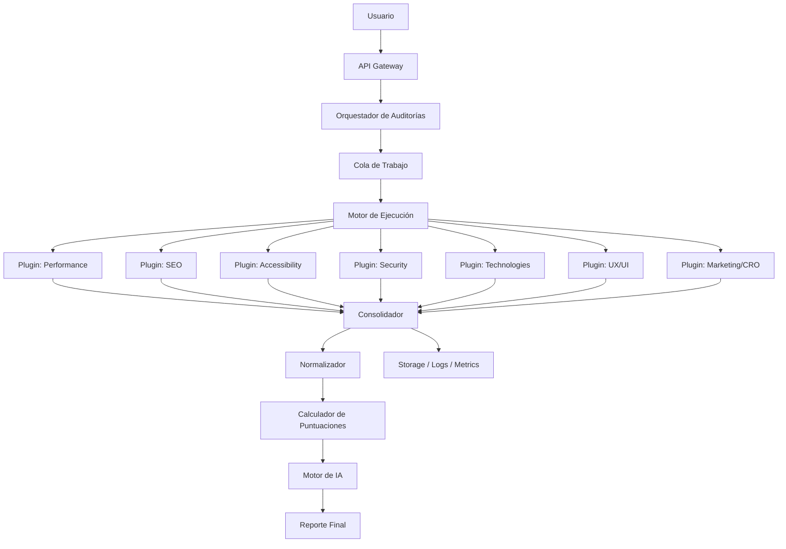

# FASE 6 – Diseño del Motor de Auditoría de SiteVision Pro

## 1. Objetivo del motor

El Motor de Auditoría es el núcleo de SiteVision Pro. Su función es recibir una URL, ejecutar múltiples análisis especializados en paralelo, consolidar los resultados, normalizarlos y entregarlos al Motor de IA para generar un informe inteligente, priorizado y accionable.

Este diseño no debe ser un simple wrapper de Lighthouse. Debe ser una plataforma modular, extensible y preparada para incorporar nuevos analizadores sin modificar el núcleo del sistema.

El motor debe cubrir:
- ejecución distribuida y escalable
- procesamiento paralelo de módulos
- normalización de resultados heterogéneos
- puntuación objetiva y explicable
- interacción con un motor de IA para razonamiento y recomendaciones
- observabilidad y trazabilidad completa

---

## 2. Principios de diseño

1. Modularidad
   - Cada auditor debe ser independiente.
   - El núcleo no debe conocer detalles internos de cada módulo.

2. Extensibilidad
   - Nuevos módulos deben agregarse como plugins sin reescribir el sistema.

3. Paralelismo
   - Los módulos pueden correr en paralelo para mejorar tiempos de respuesta.

4. Normalización
   - Cada módulo entrega datos en un formato estándar.

5. Trazabilidad
   - Cada hallazgo debe guardar origen, evidencia y contexto.

6. Robustez
   - El sistema debe tolerar fallos parciales sin perder el flujo completo.

7. Escalabilidad
   - Debe soportar miles de auditorías concurrentes y procesamiento distribuido.

---

## 3. Arquitectura general

### 3.1 Componentes principales

- Orquestador de Auditorías
- Gateway de Entrada
- Cola de Trabajo
- Motor de Ejecución
- Módulos de Auditoría (plugins)
- Consolidador de Resultados
- Normalizador de Datos
- Calculador de Puntuaciones
- Motor de IA
- Almacén de Resultados
- Observabilidad y Telemetría

### 3.2 Responsabilidades por componente

#### Orquestador de Auditorías
Coordina el ciclo completo de una auditoría. Crea el job, distribuye tareas, gestiona estados, reintentos y consolidación final.

#### Gateway de Entrada
Recibe solicitudes desde la API, valida el request y delega la ejecución al sistema de colas.

#### Cola de Trabajo
Administra la ejecución asíncrona de tareas. Permite priorizar, reintentar y ejecutar en workers separados.

#### Motor de Ejecución
Ejecuta los plugins en paralelo según el plan configurado para la auditoría.

#### Módulos de Auditoría
Implementan análisis específicos como performance, SEO, accesibilidad, seguridad, tecnologías detectadas, UX/UI y marketing/CRO.

#### Consolidador de Resultados
Reúne los resultados parciales, identifica inconsistencias y construye un resultado unificado.

#### Normalizador de Datos
Convierte los outputs de cada auditor a un formato interno estándar.

#### Calculador de Puntuaciones
Computa los scores por categoría y el Health Score global.

#### Motor de IA
Recibe los datos normalizados y genera recomendaciones, hallazgos interpretados y resumen ejecutivo.

#### Almacén de Resultados
Guarda resultados parciales, hallazgos, evidencia, métricas y reportes finales.

#### Observabilidad y Telemetría
Registra eventos, métricas, logs y trazas para diagnóstico y monitoreo.

---

## 4. Arquitectura de alto nivel



---

## 5. Flujo completo del motor

### 5.1 Flujo de procesamiento propuesto

```text
URL
│
▼
Orquestador de Auditorías
│
├── Performance Engine
├── SEO Engine
├── Security Engine
├── Accessibility Engine
├── UX Engine
├── Marketing Engine
└── Technology Detection Engine
│
▼
Normalizador de Resultados
│
▼
Motor de IA
│
▼
Reporte Final
```

### 5.2 Flujo principal

1. El usuario ingresa una URL.
2. La API valida la URL y crea un job de auditoría.
3. El orquestador registra el job y lo encola.
4. El motor de ejecución toma la tarea y selecciona los plugins habilitados.
5. Cada plugin ejecuta su análisis de forma independiente.
6. Cada módulo devuelve un resultado estructurado.
7. El consolidador reúne los resultados parciales.
8. El normalizador transforma todos los datos a un formato estándar.
9. El calculador de puntuaciones genera scores por categoría.
10. El motor de IA recibe el contexto normalizado y produce recomendaciones.
11. El resultado final se guarda y se expone al usuario.

### 5.2 Flujo de errores

Si un plugin falla:
- se marca como fallido o parcialmente completado
- se captura el error con contexto
- se puede reintentar según política
- el sistema conserva la información disponible
- la UI puede mostrar un “estado parcial” en lugar de fallar todo el job

---

## 6. Diseño modular de plugins

## 6.1 Principio general

Cada auditor debe implementarse como un plugin independiente con una interfaz estándar. El núcleo no debe depender de implementaciones concretas.

### 6.2 Interfaz estándar del plugin

```text
PluginContract
- id: string
- name: string
- version: string
- category: string
- capabilities: string[]
- run(context: AuditContext): Promise<PluginResult>
- healthCheck(): Promise<boolean>
- getMetadata(): PluginMetadata
```

### 6.3 Contexto de ejecución

Cada plugin recibe un contexto común con:
- URL objetivo
- configuración del job
- límites de tiempo
- headers de ejecución
- datos de crawl previos
- contexto de usuario o tenant
- identificador del job

### 6.4 Resultado estándar del plugin

```json
{
  "pluginId": "performance",
  "status": "completed",
  "metrics": [],
  "findings": [],
  "warnings": [],
  "evidence": [],
  "durationMs": 4200,
  "metadata": {}
}
```

---

## 7. Sistema de plugins

## 7.1 Registro de plugins

Los plugins deben registrarse en un registry central mediante:
- descubrimiento automático por carpeta o paquete
- registro manual declarativo
- metadata de categoría y prioridad

### Registro recomendado
- `pluginId`
- `name`
- `version`
- `category`
- `enabledByDefault`
- `priority`
- `dependencies`
- `executionMode`

## 7.2 Carga dinámica

La arquitectura debe soportar:
- plugins internos en el mismo monorepo
- plugins externos en paquetes independientes
- carga bajo demanda
- hot reload en entornos de desarrollo

## 7.3 Ejecución

El motor elegirá qué plugins ejecutar en función de:
- tipo de auditoría solicitada
- permisos del tenant
- recursos disponibles
- prioridad del job
- configuración del producto

## 7.4 Dependencias entre plugins

Algunos plugins pueden depender de otros. Por ejemplo:
- Performance puede requerir datos de crawl previos.
- SEO puede depender del HTML y de la estructura obtenida del sitio.
- Security puede depender de headers y respuestas HTTP.

Para esto se define un sistema de dependencias con:
- `requires`
- `provides`
- `dependsOn`

---

## 8. Módulos de auditoría

## 8.1 Performance

### Objetivo
Evaluar velocidad, carga, recursos y eficiencia general del sitio.

### Análisis incluidos
- Google Lighthouse
- PageSpeed Insights
- Core Web Vitals
- Tiempo de carga inicial
- Renderizado
- Recursos bloqueantes
- Caché
- Imágenes
- JavaScript
- CSS
- Fuentes

### Datos esperados
- LCP
- CLS
- TBT
- FCP
- INP
- total blocking time
- tamaño de recursos
- número de requests
- tiempo de DOMContentLoaded

### Salida esperada
- score de performance
- métricas crudas
- hallazgos prioritarios
- evidencia de recursos lentos

---

## 8.2 SEO Técnico

### Objetivo
Analizar la base técnica de optimización del motor de búsqueda.

### Análisis incluidos
- Meta title
- Meta description
- Canonical
- Robots.txt
- Sitemap.xml
- H1-H6
- Open Graph
- Twitter Cards
- Datos estructurados
- Alt en imágenes
- Enlaces rotos
- Redirecciones
- Estado HTTP

### Salida esperada
- score de SEO
- hallazgos de contenido y estructura
- estado de indexabilidad
- problemas de metadata y enlaces

---

## 8.3 Accesibilidad

### Objetivo
Evaluar cómo el sitio se comporta para usuarios con restricciones.

### Análisis incluidos
- WCAG
- ARIA
- Contraste
- Navegación por teclado
- Etiquetas
- Screen Readers

### Salida esperada
- score de accesibilidad
- problemas por tipo de fallo
- recomendaciones concretas de mejora

---

## 8.4 Seguridad

### Objetivo
Detectar riesgos de seguridad y configuración insegura.

### Análisis incluidos
- SSL
- HTTPS
- HSTS
- CSP
- Security Headers
- Mixed Content
- Cookies
- XSS
- Clickjacking

### Salida esperada
- score de seguridad
- hallazgos críticos y medios
- recomendaciones de mitigación

---

## 8.5 Tecnologías Detectadas

### Objetivo
Identificar la pila técnica del sitio.

### Análisis incluidos
- Framework frontend
- Backend
- CMS
- Librerías
- CDN
- Hosting
- Analytics
- Pixels
- Herramientas de terceros

### Salida esperada
- listado de tecnologías
- mapa de ecosistema técnico
- potenciales riesgos por stack

---

## 8.6 UX/UI

### Objetivo
Evaluar usabilidad visual y experiencia de interacción.

### Análisis incluidos
- Responsive
- Hero
- CTA
- Navegación
- Jerarquía visual
- Espaciados
- Consistencia
- Tipografía
- Formularios

### Salida esperada
- score de UX/UI
- recomendaciones de usabilidad y claridad
- problemas visuales detectables

---

## 8.7 Marketing y CRO

### Objetivo
Evaluar capacidad de conversión y captación de leads.

### Análisis incluidos
- Llamados a la acción
- Formularios
- Conversión
- Prueba social
- Captación de leads
- Elementos de confianza
- Embudos

### Salida esperada
- score de marketing/CRO
- hallazgos de conversión
- recomendaciones para mejorar generación de leads

---

## 9. Sistema de puntuación

## 9.1 Objetivo

El sistema debe calcular:
- Performance Score
- SEO Score
- Security Score
- Accessibility Score
- UX Score
- Marketing Score
- CRO Score
- Health Score Global (0–100)

## 9.2 Estrategia general

Cada categoría se compone de varias métricas y hallazgos. La puntuación se debe calcular de forma ponderada, con un sistema que:
- penalice severidad
- considere impacto real
- evite que una única métrica distorsione el resultado

## 9.3 Modelo recomendado

### Fórmula base

```text
score_categoria = 100 - penalizaciones_acumuladas
```

### Penalizaciones
- fallo crítico: -30 a -40 puntos
- fallo alto: -15 a -25 puntos
- fallo medio: -8 a -12 puntos
- fallo bajo: -2 a -5 puntos

### Ponderación por categoría
- Performance: 25%
- SEO: 20%
- Accessibility: 15%
- Security: 20%
- UX/UI: 10%
- Marketing/CRO: 10%

### Health Score Global

```text
Health Score = (Performance*0.25) + (SEO*0.20) + (Security*0.20) + (Accessibility*0.15) + (UX*0.10) + (MarketingCRO*0.10)
```

## 9.4 Reglas para evitar distorsiones

- No aceptar una sola métrica como definitiva.
- Usar umbrales por severidad.
- Aplicar límites máximos de penalización por categoría.
- Incluir un factor de confianza según el número de señales observadas.
- Si un plugin falla, no dejar la categoría en 0 automáticamente; usar estado parcial o `unknown`.

## 9.5 Ejemplo de normalización

Cada auditor devuelve hallazgos con:
- severidad
- impacto
- categoría
- evidencia
- confidence

El calculador transforma esto en una puntuación final con reglas explícitas.

---

## 10. Modelo de datos interno

## 10.1 Objetivo

El motor necesita un formato interno común de intercambio entre módulos para evitar acoplamiento y facilitar la consolidación.

## 10.2 Estructura recomendada de resultado base

```json
{
  "jobId": "job_123",
  "pluginId": "performance",
  "status": "completed",
  "startedAt": "2026-07-22T10:00:00Z",
  "finishedAt": "2026-07-22T10:00:05Z",
  "durationMs": 5000,
  "metrics": [
    {
      "name": "lcp",
      "value": 2.8,
      "unit": "s",
      "source": "lighthouse"
    }
  ],
  "findings": [
    {
      "id": "f-001",
      "title": "LCP above threshold",
      "severity": "high",
      "category": "performance",
      "description": "Largest Contentful Paint exceeds recommended threshold",
      "evidence": {
        "url": "https://example.com",
        "selector": "main"
      },
      "confidence": 0.92,
      "remediation": "Optimize above-the-fold rendering"
    }
  ],
  "warnings": [],
  "evidence": [],
  "metadata": {}
}
```

## 10.3 Datos que debe consolidar el motor

- métricas por categoría
- hallazgos detectados
- severidades y prioridades
- evidencia técnica
- recomendaciones
- estado general del job
- tiempos de ejecución
- errores parciales
- dependencias entre análisis

## 10.4 Resultado consolidado final

El resultado final del motor debe almacenarse como un objeto unificado con:
- scores por categoría
- hallazgos globales
- recomendaciones priorizadas
- resumen ejecutivo
- evidencia sanitaria
- estado del análisis
- metadata del job

---

## 11. Manejo de errores, reintentos y timeouts

## 11.1 Manejo de errores

Cada plugin debe devolver un estado explícito:
- `completed`
- `failed`
- `partial`
- `skipped`

## 11.2 Reintentos

- reintentos cortos para fallos transitorios
- backoff exponencial
- límite máximo por plugin
- registro detallado de reintentos

## 11.3 Timeouts

Cada plugin debe tener:
- timeout por ejecución
- timeout de red
- timeout de renderizado
- timeout máximo del job global

## 11.4 Auditorías parciales

Si un plugin falla y el resto termina bien:
- el job continúa
- se marca el módulo como incompleto
- el reporte final puede incluir una sección de “análisis incompletos”

---

## 12. Logging, eventos y observabilidad

## 12.1 Registro de eventos

El motor debe generar eventos para cada etapa:
- job_created
- validation_passed
- queued
- plugin_started
- plugin_completed
- plugin_failed
- plugin_retried
- consolidated
- normalized
- scored
- ia_ready
- report_generated
- report_failed

## 12.2 Métricas recomendadas

- tiempo total por auditoría
- tiempo por plugin
- tasa de éxito por plugin
- tasa de reintento
- número de hallazgos por categoría
- volumen de jobs activos
- latencia de colas
- porcentaje de auditorías parciales

## 12.3 Observabilidad

Se recomienda integrar:
- OpenTelemetry
- Prometheus
- Grafana
- logs estructurados
- trazas distribuidas

---

## 13. Escalabilidad horizontal

## 13.1 Soporte para miles de auditorías concurrentes

La arquitectura debe ser distribuida en varios niveles:
- API stateless
- workers independientes
- colas desacopladas
- storage escalable
- cache compartido

## 13.2 Colas de trabajo

Se recomienda:
- Redis Streams, RabbitMQ o Kafka
- separación por prioridad
- cola dedicada por tipo de plugin
- workers con autoescalado

## 13.3 Caché

- caché por URL y por job previo
- caché de resultados parciales para evitar recomputaciones
- caché de respuestas externas para reducir coste y latencia

## 13.4 Reintentos y backoff

- reintentos controlados
- límite por plugin
- separación de fallos temporales y permanentes

## 13.5 Balanceo de carga

- múltiples workers por categoría
- routing por carga y capacidades
- aislamiento por tenant o proyecto

## 13.6 Auditorías programadas

La arquitectura debe permitir:
- auditorías periódicas
- comparativas temporales
- notificaciones de degradación

## 13.7 Auditorías masivas

Para grandes volúmenes:
- batch processing
- procesamiento por lotes
- sharding lógico de tareas
- priorización por cliente o importancia

---

## 14. Integración con el Motor de IA

## 14.1 Objetivo

El Motor de IA debe interpretar los resultados técnicos y convertirlos en:
- resumen ejecutivo
- recomendaciones priorizadas
- explicaciones de impacto
- planes de mejora accionables

## 14.2 Información que recibirá la IA

Se recomienda enviar un payload consolidado con:
- metadata del site y del job
- scores por categoría
- hallazgos agrupados por severidad
- métricas técnicas con contexto
- evidencia disponible
- historial previo del proyecto
- contexto del negocio o industria, si aplica

## 14.3 Formato recomendado

```json
{
  "jobId": "job_123",
  "site": {
    "url": "https://example.com",
    "title": "Example"
  },
  "scores": {
    "performance": 72,
    "seo": 81,
    "security": 64,
    "accessibility": 78,
    "ux": 74,
    "marketing": 69,
    "cro": 71,
    "health": 73
  },
  "findings": [
    {
      "severity": "high",
      "category": "performance",
      "title": "LCP too high",
      "description": "Largest Contentful Paint exceeds ideal threshold",
      "evidence": [],
      "remediation": "Optimize image delivery and reduce JS blocking"
    }
  ],
  "context": {
    "tenant": "acme",
    "industry": "ecommerce"
  }
}
```

## 14.4 Recomendaciones para la IA

La IA debe producir:
- resumen ejecutivo en lenguaje claro
- top 5 problemas prioritarios
- orden de impacto
- recomendaciones por esfuerzo y beneficio
- posibles planes de implementación

---

## 15. Riesgos técnicos

### 15.1 Riesgos principales
- dependencias externas inestables o bloqueadas
- análisis parciales por tiempo de espera
- sobrecarga de recursos en crawlers o plugins
- resultados inconsistentes entre módulos
- alta latencia si la IA se ejecuta en cada auditoría

### 15.2 Mitigaciones
- políticas de retry y timeout
- caché por URL y por contenido
- ejecución paralela con límites de concurrencia
- normalización estricta de datos
- límites de coste y guardrails para IA

---

## 16. Recomendaciones para la siguiente fase

### Prioridades iniciales
1. Definir la interfaz estándar de plugins.
2. Implementar los primeros plugins: Performance y SEO.
3. Crear el orquestador y la cola de trabajo.
4. Diseñar el modelo de resultados normalizado.
5. Definir el pipeline de puntuación y el payload de IA.
6. Preparar observabilidad y logging desde el inicio.

### Fase de implementación recomendada
- Fase A: motor base + plugin de performance + plugin de SEO
- Fase B: accesibilidad y seguridad
- Fase C: tecnologías, UX/UI y marketing/CRO
- Fase D: IA y reportes inteligentes

---

## 17. Recomendación final

El Motor de Auditoría de SiteVision Pro debe ser un sistema distribuido, modular y orientado a plugins, capaz de ejecutar análisis especializados en paralelo, normalizar resultados y entregar un panorama técnico y de negocio claro. La arquitectura propuesta combina escalabilidad, trazabilidad, extensibilidad y claridad de datos, lo que la convierte en una base sólida para las siguientes fases de desarrollo.
